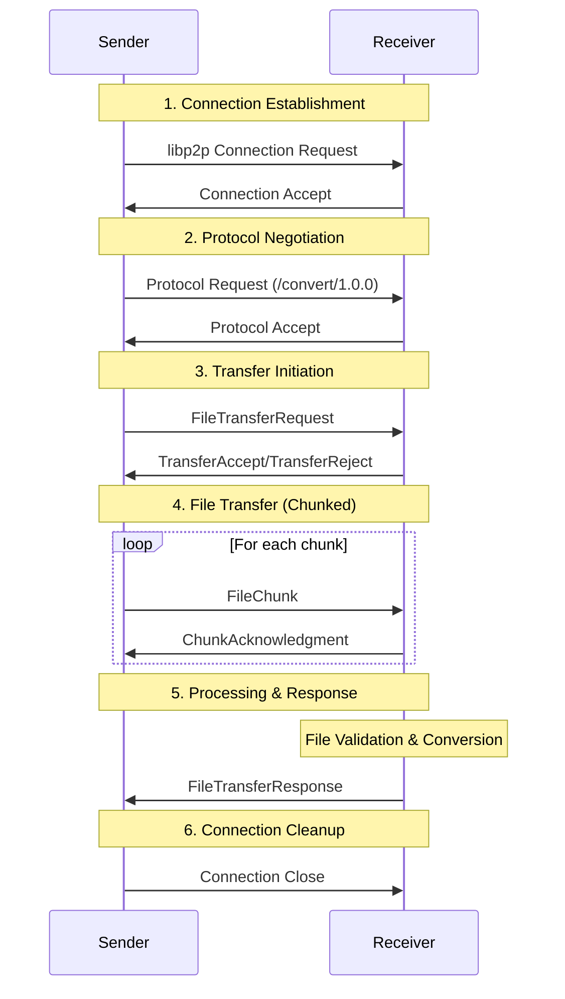

# P2P File Converter Protocol Documentation

## Overview

The P2P File Converter uses a custom protocol built on top of libp2p to facilitate secure, efficient file transfer and conversion between peers. This document describes the protocol design, message formats, and implementation details.

## Protocol Specification

### Protocol Identifier

- **Protocol Name**: `/convert/1.0.0`
- **Transport**: TCP with libp2p
- **Encryption**: Noise protocol (XX handshake pattern)
- **Multiplexing**: Yamux

### Protocol Flow



## Message Formats

All messages are serialized using bincode for efficient binary encoding.

### 1. FileTransferRequest

Initiates a file transfer session.

```rust
#[derive(Serialize, Deserialize, Debug, Clone)]
pub struct FileTransferRequest {
    /// Unique identifier for this transfer
    pub transfer_id: String,

    /// Original filename
    pub filename: String,

    /// Total file size in bytes
    pub file_size: u64,

    /// Detected file type (txt, pdf, unknown)
    pub file_type: String,

    /// Requested target format (optional)
    pub target_format: Option<String>,

    /// Whether to return converted file data
    pub return_result: bool,

    /// Total number of chunks to be sent
    pub chunk_count: usize,

    /// Optional metadata
    pub metadata: HashMap<String, String>,
}
```

**Example**:
```json
{
    "transfer_id": "550e8400-e29b-41d4-a716-446655440000",
    "filename": "document.txt",
    "file_size": 2048576,
    "file_type": "txt",
    "target_format": "pdf",
    "return_result": false,
    "chunk_count": 2,
    "metadata": {
        "author": "user@example.com",
        "created": "2025-10-07T07:47:00Z"
    }
}
```

### 2. TransferAccept/TransferReject

Response to transfer request.

```rust
#[derive(Serialize, Deserialize, Debug, Clone)]
pub enum TransferResponse {
    Accept {
        transfer_id: String,
        max_chunk_size: usize,
        supported_formats: Vec<String>,
    },
    Reject {
        transfer_id: String,
        reason: String,
        error_code: u32,
    },
}
```

**Accept Example**:
```json
{
    "Accept": {
        "transfer_id": "550e8400-e29b-41d4-a716-446655440000",
        "max_chunk_size": 1048576,
        "supported_formats": ["txt", "pdf"]
    }
}
```

**Reject Example**:
```json
{
    "Reject": {
        "transfer_id": "550e8400-e29b-41d4-a716-446655440000",
        "reason": "File too large",
        "error_code": 413
    }
}
```

### 3. FileChunk

Contains actual file data in chunks.

```rust
#[derive(Serialize, Deserialize, Debug, Clone)]
pub struct FileChunk {
    /// Transfer identifier
    pub transfer_id: String,

    /// Chunk sequence number (0-based)
    pub chunk_index: usize,

    /// Chunk data (up to max_chunk_size bytes)
    pub data: Vec<u8>,

    /// Whether this is the final chunk
    pub is_final: bool,

    /// Optional checksum for integrity verification
    pub checksum: Option<String>,
}
```

### 4. ChunkAcknowledgment

Acknowledges receipt of a chunk.

```rust
#[derive(Serialize, Deserialize, Debug, Clone)]
pub struct ChunkAcknowledgment {
    /// Transfer identifier
    pub transfer_id: String,

    /// Acknowledged chunk index
    pub chunk_index: usize,

    /// Acknowledgment status
    pub status: ChunkStatus,
}

#[derive(Serialize, Deserialize, Debug, Clone)]
pub enum ChunkStatus {
    /// Chunk received successfully
    Received,

    /// Chunk failed validation (request resend)
    Invalid { reason: String },

    /// Chunk received out of order
    OutOfOrder { expected: usize },
}
```

### 5. FileTransferResponse

Final response after processing.

```rust
#[derive(Serialize, Deserialize, Debug, Clone)]
pub struct FileTransferResponse {
    /// Transfer identifier
    pub transfer_id: String,

    /// Overall success status
    pub success: bool,

    /// Error message if failed
    pub error_message: Option<String>,

    /// Converted file data (if requested and successful)
    pub converted_data: Option<Vec<u8>>,

    /// Filename of converted file
    pub converted_filename: Option<String>,

    /// Processing time in milliseconds
    pub processing_time_ms: u64,

    /// Validation results
    pub validation_results: ValidationResults,
}

#[derive(Serialize, Deserialize, Debug, Clone)]
pub struct ValidationResults {
    /// File integrity check passed
    pub integrity_verified: bool,

    /// File type validation passed  
    pub file_type_valid: bool,

    /// File size validation passed
    pub file_size_valid: bool,

    /// Any validation warnings
    pub warnings: Vec<String>,
}
```

## Protocol States

### Sender States

```rust
#[derive(Debug, Clone, PartialEq)]
pub enum SenderState {
    /// Initial state, not connected
    Disconnected,

    /// Establishing connection to peer
    Connecting,

    /// Negotiating protocol version
    Negotiating,

    /// Waiting for transfer acceptance
    AwaitingAccept,

    /// Sending file chunks
    SendingChunks { 
        sent_chunks: usize,
        total_chunks: usize,
    },

    /// Waiting for final response
    AwaitingResponse,

    /// Transfer completed successfully
    Completed,

    /// Transfer failed
    Failed { error: String },

    /// Transfer cancelled by user
    Cancelled,
}
```

### Receiver States

```rust
#[derive(Debug, Clone, PartialEq)]
pub enum ReceiverState {
    /// Listening for connections
    Listening,

    /// Processing transfer request
    EvaluatingRequest,

    /// Receiving file chunks
    ReceivingChunks {
        received_chunks: usize,
        total_chunks: usize,
        buffer: Vec<u8>,
    },

    /// Validating received file
    Validating,

    /// Converting file format
    Converting,

    /// Saving file to disk
    Saving,

    /// Sending response to sender
    SendingResponse,

    /// Transfer completed
    Completed,

    /// Transfer failed
    Failed { error: String },
}
```

## Error Codes

The protocol defines standard error codes for common failure scenarios:

| Code | Category | Description |
|------|----------|-------------|
| 400  | BadRequest | Malformed request message |
| 401  | Unauthorized | Peer not authorized for transfer |
| 403  | Forbidden | Transfer not allowed by policy |  
| 413  | PayloadTooLarge | File exceeds size limits |
| 415  | UnsupportedMediaType | File type not supported |
| 422  | UnprocessableEntity | File validation failed |
| 429  | TooManyRequests | Rate limit exceeded |
| 500  | InternalServerError | Server processing error |
| 503  | ServiceUnavailable | Server temporarily unavailable |
| 507  | InsufficientStorage | Not enough disk space |

## Security Considerations

### Transport Security

1. **Encryption**: All communication encrypted with Noise protocol
2. **Authentication**: Peer identity verification using public key cryptography
3. **Forward Secrecy**: Keys rotated for each session

### Application Security

1. **Input Validation**: All messages validated before processing
2. **Path Sanitization**: File paths checked for directory traversal
3. **Resource Limits**: Configurable limits on file size, transfer rate, and memory usage
4. **Timeout Protection**: All operations have configurable timeouts

### Threat Mitigation

| Threat | Mitigation |
|--------|------------|
| Man-in-the-middle | Noise protocol with peer authentication |
| Replay attacks | Unique transfer IDs and timestamps |
| DoS attacks | Rate limiting and resource quotas |
| Malicious files | File type validation and size limits |
| Path traversal | Path sanitization and chroot |
| Memory exhaustion | Chunked processing and memory limits |

## Implementation Guidelines

### Chunking Strategy

```rust
const DEFAULT_CHUNK_SIZE: usize = 1024 * 1024; // 1MB
const MAX_CHUNK_SIZE: usize = 10 * 1024 * 1024; // 10MB
const MIN_CHUNK_SIZE: usize = 64 * 1024; // 64KB

fn calculate_chunk_size(file_size: u64, network_conditions: &NetworkInfo) -> usize {
    let base_size = if file_size < 10 * 1024 * 1024 {
        // Small files: use smaller chunks
        64 * 1024
    } else if file_size < 100 * 1024 * 1024 {
        // Medium files: standard chunks
        1024 * 1024
    } else {
        // Large files: bigger chunks for efficiency
        4 * 1024 * 1024
    };

    // Adjust based on network conditions
    match network_conditions.quality {
        NetworkQuality::Poor => base_size / 4,
        NetworkQuality::Good => base_size,
        NetworkQuality::Excellent => base_size * 2,
    }
}
```

### Flow Control

```rust
const MAX_OUTSTANDING_CHUNKS: usize = 3;
const ACK_TIMEOUT: Duration = Duration::from_secs(30);

struct FlowController {
    outstanding_chunks: VecDeque<usize>,
    max_outstanding: usize,
    ack_timeouts: HashMap<usize, Instant>,
}

impl FlowController {
    fn can_send_chunk(&self) -> bool {
        self.outstanding_chunks.len() < self.max_outstanding
    }

    fn chunk_sent(&mut self, chunk_index: usize) {
        self.outstanding_chunks.push_back(chunk_index);
        self.ack_timeouts.insert(chunk_index, Instant::now() + ACK_TIMEOUT);
    }

    fn chunk_acknowledged(&mut self, chunk_index: usize) {
        self.outstanding_chunks.retain(|&x| x != chunk_index);
        self.ack_timeouts.remove(&chunk_index);
    }

    fn check_timeouts(&mut self) -> Vec<usize> {
        let now = Instant::now();
        let mut timed_out = Vec::new();

        for (&chunk_index, &timeout) in &self.ack_timeouts {
            if now > timeout {
                timed_out.push(chunk_index);
            }
        }

        for &chunk_index in &timed_out {
            self.chunk_acknowledged(chunk_index); // Remove from tracking
        }

        timed_out
    }
}
```

### Error Recovery

```rust
#[derive(Debug, Clone)]
pub struct RetryConfig {
    pub max_retries: usize,
    pub initial_delay: Duration,
    pub max_delay: Duration,
    pub backoff_multiplier: f64,
}

impl Default for RetryConfig {
    fn default() -> Self {
        Self {
            max_retries: 3,
            initial_delay: Duration::from_millis(500),
            max_delay: Duration::from_secs(30),
            backoff_multiplier: 2.0,
        }
    }
}

async fn retry_with_backoff<F, Fut, T, E>(
    operation: F,
    config: &RetryConfig,
) -> Result<T, E>
where
    F: Fn() -> Fut,
    Fut: Future<Output = Result<T, E>>,
{
    let mut delay = config.initial_delay;
    let mut last_error = None;

    for attempt in 0..=config.max_retries {
        match operation().await {
            Ok(result) => return Ok(result),
            Err(error) => {
                last_error = Some(error);

                if attempt < config.max_retries {
                    tokio::time::sleep(delay).await;
                    delay = std::cmp::min(
                        Duration::from_millis(
                            (delay.as_millis() as f64 * config.backoff_multiplier) as u64
                        ),
                        config.max_delay,
                    );
                }
            }
        }
    }

    Err(last_error.unwrap())
}
```

## Performance Optimizations

### Batched Acknowledgments

Instead of acknowledging each chunk individually, batch acknowledgments for better performance:

```rust
#[derive(Serialize, Deserialize, Debug, Clone)]
pub struct BatchedAcknowledgment {
    pub transfer_id: String,
    pub acknowledged_chunks: Vec<usize>,
    pub next_expected_chunk: usize,
}
```

### Compression

Optional compression for text files:

```rust
#[derive(Serialize, Deserialize, Debug, Clone)]
pub enum CompressionType {
    None,
    Gzip,
    Lzma,
}

// In FileTransferRequest
pub compression: CompressionType,
```

### Pipeline Optimization

```rust
const PIPELINE_DEPTH: usize = 5;

async fn pipelined_send(
    chunks: Vec<FileChunk>,
    stream: &mut impl AsyncWrite,
) -> Result<(), Error> {
    let semaphore = Arc::new(Semaphore::new(PIPELINE_DEPTH));
    let mut tasks = Vec::new();

    for chunk in chunks {
        let permit = semaphore.clone().acquire_owned().await?;
        let stream = stream.clone();

        let task = tokio::spawn(async move {
            let _permit = permit;
            send_chunk(chunk, stream).await
        });

        tasks.push(task);
    }

    // Wait for all chunks to be sent
    for task in tasks {
        task.await??;
    }

    Ok(())
}
```

## Protocol Extensions

### Future Extensions

The protocol is designed to be extensible. Future versions might include:

1. **Resume Capability**: Resume interrupted transfers
2. **Delta Sync**: Send only file differences
3. **Multi-peer Distribution**: Split files across multiple peers
4. **Stream Processing**: Process files without full buffering
5. **Custom Codecs**: Support for additional file formats

### Version Negotiation

```rust
#[derive(Serialize, Deserialize, Debug, Clone)]
pub struct ProtocolVersion {
    pub major: u32,
    pub minor: u32,
    pub patch: u32,
}

#[derive(Serialize, Deserialize, Debug, Clone)]  
pub struct ProtocolCapabilities {
    pub version: ProtocolVersion,
    pub supported_formats: Vec<String>,
    pub max_file_size: u64,
    pub features: Vec<String>,
}
```

## Testing and Validation

### Protocol Compliance Tests

```rust
#[tokio::test]
async fn test_protocol_flow() {
    let (sender, receiver) = create_test_peers().await;

    // Test complete protocol flow
    let request = FileTransferRequest {
        transfer_id: "test-123".to_string(),
        filename: "test.txt".to_string(),
        file_size: 1024,
        file_type: "txt".to_string(),
        target_format: Some("pdf".to_string()),
        return_result: false,
        chunk_count: 1,
        metadata: HashMap::new(),
    };

    // Send request
    sender.send_request(request).await?;

    // Verify receiver processes request
    let response = receiver.receive_request().await?;
    assert!(matches!(response, TransferResponse::Accept { .. }));

    // Send chunks
    let chunk = FileChunk {
        transfer_id: "test-123".to_string(),
        chunk_index: 0,
        data: b"Hello, World!".to_vec(),
        is_final: true,
        checksum: None,
    };

    sender.send_chunk(chunk).await?;

    // Verify final response
    let final_response = sender.receive_response().await?;
    assert!(final_response.success);
}
```

### Stress Testing

```rust
#[tokio::test]
async fn test_large_file_transfer() {
    let large_data = vec![0u8; 100 * 1024 * 1024]; // 100MB
    test_file_transfer(large_data).await;
}

#[tokio::test]
async fn test_many_small_files() {
    for i in 0..1000 {
        let small_data = format!("File {}", i).into_bytes();
        test_file_transfer(small_data).await;
    }
}
```

This protocol documentation provides a comprehensive guide for implementing compatible P2P file converter clients and understanding the communication patterns used by the system.
