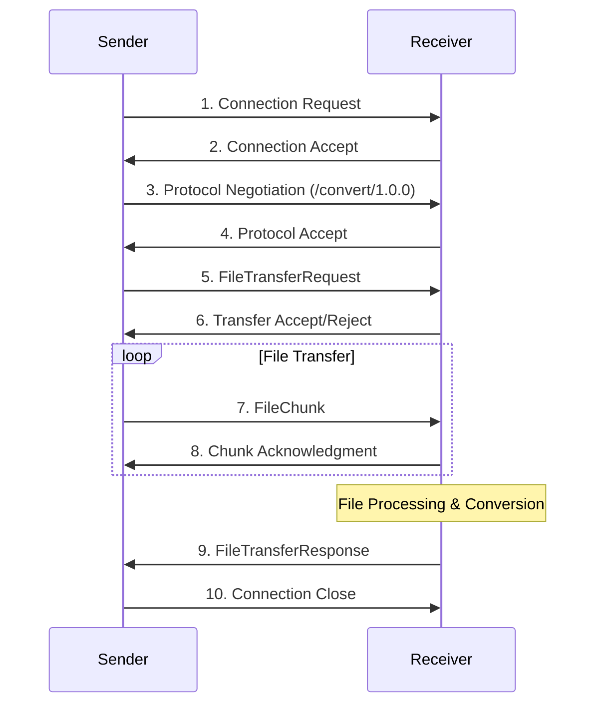

# P2P File Converter

[](https://www.rust-lang.org)
[](https://opensource.org/licenses/MIT)
[](https://github.com/user/p2p-file-converter)

A high-performance, peer-to-peer file converter built with Rust and libp2p. Convert files between different formats (text ↔ PDF) using a distributed, decentralized network without requiring a central server.

## 🚀 Features

- **🌐 Peer-to-Peer Architecture**: No central server required, fully distributed
- **📄 File Format Conversion**: Text ↔ PDF conversion with configurable styling
- **⚡ Real-time Progress Tracking**: Live transfer status with speed and ETA
- **🔄 Automatic Retry Logic**: Exponential backoff for failed operations
- **🛡️ Comprehensive Error Handling**: Robust error recovery and user-friendly messages
- **🔒 Secure Communication**: Noise protocol encryption for all peer communication
- **📊 Resource Management**: RAII patterns with automatic cleanup and leak detection
- **🎯 Input Validation**: Comprehensive validation for addresses, files, and configurations
- **📈 Performance Monitoring**: Built-in metrics and health status reporting
- **🧪 Extensive Testing**: Unit, integration, and end-to-end test coverage

## 📦 Installation

### Prerequisites

- **Rust 1.70+**: Install from [rustup.rs](https://rustup.rs/)
- **Git**: For cloning the repository
- **System fonts**: For PDF generation (Linux users may need to install fonts)

### From Source

```bash
# Clone the repository
git clone https://github.com/username/p2p-file-converter.git
cd p2p-file-converter

# Build in release mode
cargo build --release

# Install globally (optional)
cargo install --path .
```

### From Crates.io

```bash
cargo install p2p-file-converter
```

### System Dependencies

#### Linux (Ubuntu/Debian)
```bash
sudo apt update
sudo apt install -y build-essential pkg-config libfontconfig1-dev
```

#### macOS
```bash
# Install Xcode command line tools
xcode-select --install

# Install Homebrew if not already installed
/bin/bash -c "$(curl -fsSL https://raw.githubusercontent.com/Homebrew/install/HEAD/install.sh)"
```

#### Windows
- Install [Microsoft C++ Build Tools](https://visualstudio.microsoft.com/visual-cpp-build-tools/)
- Install [Git for Windows](https://git-scm.com/download/win)

## 🏃 Quick Start

### 1. Start a Receiver Node

```bash
# Basic receiver (auto-detects available port)
p2p-converter

# Receiver with specific configuration
p2p-converter --listen /ip4/0.0.0.0/tcp/8080 \
              --output-dir ./received_files \
              --verbose
```

The receiver will display its peer address:
```
🌐 Listening on: /ip4/192.168.1.100/tcp/8080/p2p/12D3KooWBmwkafWE2fqfzS96VoTZgpGp6aJsF4SJ6eAR5AHXCXAZ
📁 Output directory: ./received_files
```

### 2. Send Files from Another Node

```bash
# Send a file with format conversion
p2p-converter --target /ip4/192.168.1.100/tcp/8080/p2p/12D3KooWBmwkafWE2fqfzS96VoTZgpGp6aJsF4SJ6eAR5AHXCXAZ \
              --file document.txt \
              --format pdf

# Send without conversion
p2p-converter --target /ip4/192.168.1.100/tcp/8080/p2p/12D3KooWBmwkafWE2fqfzS96VoTZgpGp6aJsF4SJ6eAR5AHXCXAZ \
              --file presentation.pdf
```

### 3. Monitor Progress

The sender shows real-time progress:
```
📤 Connecting to peer...
🤝 Protocol negotiation successful
📊 Progress: 45.2% (1.2 MB/s) - ETA: 12s
✅ Transfer completed! Sent 2.5 MB in 15.3s
```

## 📋 Usage Examples

### Basic Operations

#### Receiver Mode
```bash
# Start receiver with default settings
p2p-converter

# Custom output directory and port
p2p-converter --listen /ip4/0.0.0.0/tcp/9000 \
              --output-dir ~/Downloads/p2p

# Enable auto-conversion of received files
p2p-converter --auto-convert --verbose
```

#### Sender Mode
```bash
# Send with PDF conversion
p2p-converter --target PEER_ADDRESS --file report.txt --format pdf

# Send batch files
for file in documents/*.txt; do
    p2p-converter --target PEER_ADDRESS --file "$file" --format pdf
done

# Send with custom retry settings
p2p-converter --target PEER_ADDRESS --file large_file.txt \
              --max-retries 10 --timeout 120
```

### Advanced Configuration

#### Using Configuration Files

Create `config.toml`:
```toml
[network]
connection_timeout_secs = 30
max_retry_attempts = 5
keep_alive = true

[files]
max_file_size = 104857600  # 100MB
allowed_extensions = ["txt", "pdf", "md", "rtf"]
output_directory = "./converted_files"

[conversion]
timeout_secs = 300
parallel_processing = true

[conversion.pdf_config]
font_size = 12
margins = 20
line_spacing = 1.2
title = "Converted Document"

[error_handling]
verbose_errors = false
log_errors = true
enable_recovery = true
```

Then run:
```bash
p2p-converter --config config.toml
```

#### Environment Variables

```bash
export P2P_OUTPUT_DIR="./my_files"
export P2P_MAX_FILE_SIZE="50MB"
export P2P_LOG_LEVEL="debug"
export RUST_LOG="p2p_file_converter=debug,libp2p=info"

p2p-converter --listen /ip4/0.0.0.0/tcp/8080
```

### Network Setup Examples

#### Local Network
```bash
# Node 1 (192.168.1.100)
p2p-converter --listen /ip4/192.168.1.100/tcp/8080

# Node 2 (192.168.1.101) - send to Node 1
p2p-converter --target /ip4/192.168.1.100/tcp/8080/p2p/PEER_ID \
              --file document.txt
```

#### Internet (with port forwarding)
```bash
# Server (with port 8080 forwarded)
p2p-converter --listen /ip4/0.0.0.0/tcp/8080

# Client (connecting to public IP)
p2p-converter --target /ip4/203.0.113.1/tcp/8080/p2p/PEER_ID \
              --file myfile.pdf --format txt
```

#### IPv6 Support
```bash
# IPv6 receiver
p2p-converter --listen /ip6/::/tcp/8080

# IPv6 sender
p2p-converter --target /ip6/2001:db8::1/tcp/8080/p2p/PEER_ID \
              --file document.txt
```

## 🏗️ Architecture

### System Overview

```
┌─────────────────┐    libp2p/TCP     ┌─────────────────┐
│   Sender Node   │ ←───────────────→ │  Receiver Node  │
│                 │    Noise Protocol │                 │
│ ┌─────────────┐ │                   │ ┌─────────────┐ │
│ │File Sender  │ │                   │ │Stream       │ │
│ │- Chunking   │ │                   │ │Handler      │ │
│ │- Progress   │ │                   │ │- Validation │ │
│ │- Retry      │ │                   │ │- Conversion │ │
│ └─────────────┘ │                   │ └─────────────┘ │
└─────────────────┘                   └─────────────────┘
```

### Component Architecture

```
┌─────────────────────────────────────────────────────────────┐
│                    P2P File Converter                      │
├─────────────────────────────────────────────────────────────┤
│ ┌─────────────┐ ┌─────────────┐ ┌─────────────┐ ┌─────────┐ │
│ │    CLI      │ │  Main Event │ │   Error     │ │ Config  │ │
│ │   Parser    │ │    Loop     │ │  Handling   │ │ Manager │ │
│ └─────────────┘ └─────────────┘ └─────────────┘ └─────────┘ │
├─────────────────────────────────────────────────────────────┤
│ ┌─────────────┐ ┌─────────────┐ ┌─────────────┐ ┌─────────┐ │
│ │    File     │ │  P2P Stream │ │    File     │ │Resource │ │
│ │  Converter  │ │   Handler   │ │   Sender    │ │Cleanup  │ │
│ └─────────────┘ └─────────────┘ └─────────────┘ └─────────┘ │
├─────────────────────────────────────────────────────────────┤
│ ┌─────────────┐ ┌─────────────┐ ┌─────────────┐ ┌─────────┐ │
│ │   libp2p    │ │    Tokio    │ │  Validation │ │Timeout  │ │
│ │  Networking │ │   Runtime   │ │   System    │ │Manager  │ │
│ └─────────────┘ └─────────────┘ └─────────────┘ └─────────┘ │
└─────────────────────────────────────────────────────────────┘
```

### Protocol Flow



## 🔧 Configuration

### Command Line Options

```
USAGE:
    p2p-converter [OPTIONS] [SUBCOMMAND]

OPTIONS:
    -t, --target <MULTIADDR>     Target peer address (sender mode)
    -f, --file <FILE>            File to send (sender mode)
    -l, --listen <ADDR>          Listen address (receiver mode)
    -o, --output-dir <DIR>       Output directory [default: ./output]
        --format <FORMAT>        Target format (txt, pdf)
        --max-size <SIZE>        Max file size in MB [default: 100]
        --max-retries <NUM>      Max retry attempts [default: 5]
        --timeout <SECS>         Connection timeout [default: 30]
        --config <FILE>          Configuration file path
        --auto-convert           Enable automatic conversion
    -v, --verbose                Enable verbose logging
    -h, --help                   Print help information
    -V, --version                Print version information

SUBCOMMANDS:
    send        Send files to peers
    receive     Start receiver mode
    config      Configuration management
    help        Print this message or the help of the given subcommand
```

### Configuration File Format

The configuration file uses TOML format:

```toml
# Network configuration
[network]
connection_timeout_secs = 30
max_retry_attempts = 5
keep_alive = true
bandwidth_limit = 0  # 0 = unlimited

# File handling
[files]
max_file_size = 104857600  # 100MB in bytes
allowed_extensions = ["txt", "pdf", "md", "rtf", "doc"]
output_directory = "./received_files"
integrity_check = true

# Conversion settings
[conversion]
timeout_secs = 300  # 5 minutes
parallel_processing = true
max_memory_mb = 1024  # 1GB

# PDF conversion options
[conversion.pdf_config]
title = "Converted Document"
font_size = 12
margins = 20
line_spacing = 1.2
font_family = "LiberationSans"

# Error handling
[error_handling]
verbose_errors = false
log_errors = true
error_log_path = "./error.log"
enable_recovery = true

# Logging configuration
[logging]
level = "info"
file = "./p2p-converter.log"
max_size_mb = 10
rotate_count = 5
```

### Environment Variables

- `P2P_CONFIG_FILE`: Configuration file path
- `P2P_OUTPUT_DIR`: Default output directory
- `P2P_MAX_FILE_SIZE`: Maximum file size (e.g., "50MB")
- `P2P_LOG_LEVEL`: Logging level (error|warn|info|debug|trace)
- `RUST_LOG`: Rust logging configuration

## 🧪 Testing

### Running Tests

```bash
# Run all tests
cargo test

# Run specific test categories
cargo test unit_tests
cargo test integration_tests
cargo test e2e_tests

# Run with output
cargo test -- --nocapture

# Run performance tests
cargo test performance_tests --release

# Generate test coverage
cargo tarpaulin --out Html
```

### Test Categories

1. **Unit Tests**: Individual component testing
   - File conversion functions
   - Validation logic
   - Error handling
   - Configuration parsing

2. **Integration Tests**: Component interaction testing
   - P2P networking
   - Protocol handling
   - File transfer simulation
   - Error recovery

3. **End-to-End Tests**: Full system testing
   - Multi-peer scenarios
   - Real file transfers
   - Performance under load
   - Resource cleanup

### Sample Test Data

The repository includes comprehensive test data:

```
sample_files/
├── simple.txt              # Basic text file
├── document.txt            # Multi-paragraph document
├── unicode_test.txt        # Unicode character testing
├── large_text.txt          # Performance testing (1MB+)
├── simple.pdf              # Basic PDF file
├── multipage.pdf           # Multi-page PDF
├── sample.md               # Markdown documentation
├── test_config.toml        # Test configuration
└── run_tests.sh            # Test execution script
```

### Creating Test Environment

```bash
# Create sample files
cargo run --bin create_sample_files

# Run comprehensive tests
./sample_files/run_tests.sh

# Manual testing
p2p-converter --listen /ip4/127.0.0.1/tcp/8080 &
sleep 2
p2p-converter --target /ip4/127.0.0.1/tcp/8080/p2p/$(cat peer_id) \
              --file sample_files/document.txt --format pdf
```

## 📊 Performance

### Benchmarks

Typical performance characteristics on modern hardware:

- **Small files** (<1MB): 50-100ms total transfer time
- **Medium files** (1-10MB): 200-500ms total transfer time  
- **Large files** (10-100MB): 50-100 MB/s transfer rate
- **Conversion speed**: 
  - Text→PDF: ~1-5 MB/s depending on complexity
  - PDF→Text: ~10-20 MB/s depending on content
- **Memory usage**: ~10MB baseline + 1MB per active transfer
- **CPU usage**: <5% during normal operation

### Performance Tuning

```toml
# High-performance configuration
[network]
connection_timeout_secs = 60
max_retry_attempts = 3

[files]
max_file_size = 1073741824  # 1GB

[conversion]
parallel_processing = true
max_memory_mb = 4096  # 4GB
timeout_secs = 600    # 10 minutes
```

### Monitoring

```bash
# Enable performance monitoring
export RUST_LOG="p2p_file_converter=debug"
p2p-converter --verbose

# Monitor system resources
htop  # or top
iotop  # I/O monitoring
```

## 🛡️ Security

### Security Features

- **Noise Protocol**: All peer communication is encrypted end-to-end
- **Peer Authentication**: Cryptographic verification of peer identities
- **Input Validation**: Comprehensive validation prevents injection attacks
- **Path Sanitization**: Prevents directory traversal attacks
- **Resource Limits**: Configurable limits prevent DoS attacks
- **Memory Safety**: Rust's memory safety prevents buffer overflows

### Security Best Practices

1. **Network Security**:
   - Use firewall rules to restrict access
   - Consider VPN for internet deployments
   - Monitor network traffic for anomalies

2. **File Security**:
   - Validate file types before processing
   - Set appropriate file size limits
   - Use dedicated directories for received files
   - Regular cleanup of temporary files

3. **System Security**:
   - Run with minimal required permissions
   - Keep system and dependencies updated
   - Monitor log files for suspicious activity
   - Use configuration files with proper permissions

### Threat Model

The system is designed to be resilient against:

- **Network attacks**: DoS, man-in-the-middle, packet injection
- **File attacks**: Path traversal, malicious content, oversized files
- **Resource attacks**: Memory exhaustion, disk space attacks
- **Protocol attacks**: Replay attacks, protocol confusion

## 🐛 Troubleshooting

### Common Issues

#### Connection Problems

**Error**: `Connection refused`
```bash
# Check if receiver is running
ps aux | grep p2p-converter

# Test network connectivity
ping <peer-ip>
telnet <peer-ip> <peer-port>

# Check firewall
sudo ufw status
sudo iptables -L
```

**Error**: `Connection timeout`
```bash
# Increase timeout
p2p-converter --timeout 60 --target <peer-address> --file <file>

# Check network latency
ping <peer-ip>
traceroute <peer-ip>
```

#### File Issues

**Error**: `File not found`
```bash
# Check file exists and permissions
ls -la <file-path>
file <file-path>

# Check working directory
pwd
```

**Error**: `File too large`
```bash
# Check file size
du -h <file-path>

# Increase size limit
p2p-converter --max-size 200 --target <peer> --file <file>
```

#### Conversion Problems

**Error**: `PDF generation failed`
```bash
# Check system fonts (Linux)
fc-list
sudo apt install fonts-liberation

# Check available memory
free -h
```

**Error**: `Text extraction failed`
```bash
# Verify PDF file
file <pdf-file>
pdfinfo <pdf-file>  # if available
```

### Debug Mode

Enable detailed logging:

```bash
# Maximum verbosity
export RUST_LOG="debug,libp2p=info"
p2p-converter --verbose

# Log to file
p2p-converter --verbose 2>&1 | tee debug.log

# Analyze logs
grep -i error debug.log
grep -i timeout debug.log
```

### Performance Issues

**Slow transfers**:
```bash
# Check system resources
htop
iotop

# Monitor network
ifstat
netstat -i

# Check disk space
df -h
```

**High memory usage**:
```bash
# Reduce concurrent transfers
p2p-converter --config config.toml  # with lower limits

# Monitor memory
watch -n 1 'ps aux | grep p2p-converter'
```

### Getting Help

1. **Check logs**: Review error logs for specific error messages
2. **Search issues**: Check GitHub issues for similar problems
3. **Create minimal reproduction**: Isolate the problem with simple test case
4. **Report bugs**: Create detailed issue with logs and system information

```bash
# Collect system information
uname -a
rustc --version
cargo --version
ldd --version  # Linux
```

## 🤝 Contributing

We welcome contributions! Please see [CONTRIBUTING.md](CONTRIBUTING.md) for guidelines.

### Development Setup

```bash
git clone https://github.com/username/p2p-file-converter.git
cd p2p-file-converter

# Install development dependencies
cargo install cargo-tarpaulin  # Coverage
cargo install cargo-audit      # Security audit
cargo install cargo-outdated   # Dependency updates

# Run development checks
cargo check
cargo clippy
cargo fmt --check
cargo test
cargo audit
```

### Code Style

- Follow Rust standard formatting (`cargo fmt`)
- Use `cargo clippy` for linting
- Write comprehensive tests for new features
- Document public APIs with rustdoc
- Follow semantic versioning

### Pull Request Process

1. Fork the repository
2. Create a feature branch (`git checkout -b feature/amazing-feature`)
3. Make your changes with tests
4. Run the full test suite (`cargo test`)
5. Commit your changes (`git commit -m 'Add amazing feature'`)
6. Push to the branch (`git push origin feature/amazing-feature`)
7. Open a Pull Request

## 📄 License

This project is licensed under the MIT License - see the [LICENSE](LICENSE) file for details.

## 🙏 Acknowledgments

- [libp2p](https://libp2p.io/) - Modular peer-to-peer networking library
- [Tokio](https://tokio.rs/) - Asynchronous runtime for Rust
- [clap](https://clap.rs/) - Command line argument parser
- [serde](https://serde.rs/) - Serialization framework
- [anyhow](https://github.com/dtolnay/anyhow) - Error handling library
- [thiserror](https://github.com/dtolnay/thiserror) - Custom error types

## 🔗 Links

- **Documentation**: [docs.rs/p2p-file-converter](https://docs.rs/p2p-file-converter)
- **Repository**: [github.com/username/p2p-file-converter](https://github.com/username/p2p-file-converter)
- **Issues**: [github.com/username/p2p-file-converter/issues](https://github.com/username/p2p-file-converter/issues)
- **Discussions**: [github.com/username/p2p-file-converter/discussions](https://github.com/username/p2p-file-converter/discussions)

---

**Built with ❤️ and Rust by the P2P File Converter Team**

For questions, support, or feature requests, please open an issue on GitHub or start a discussion in our community forum.
